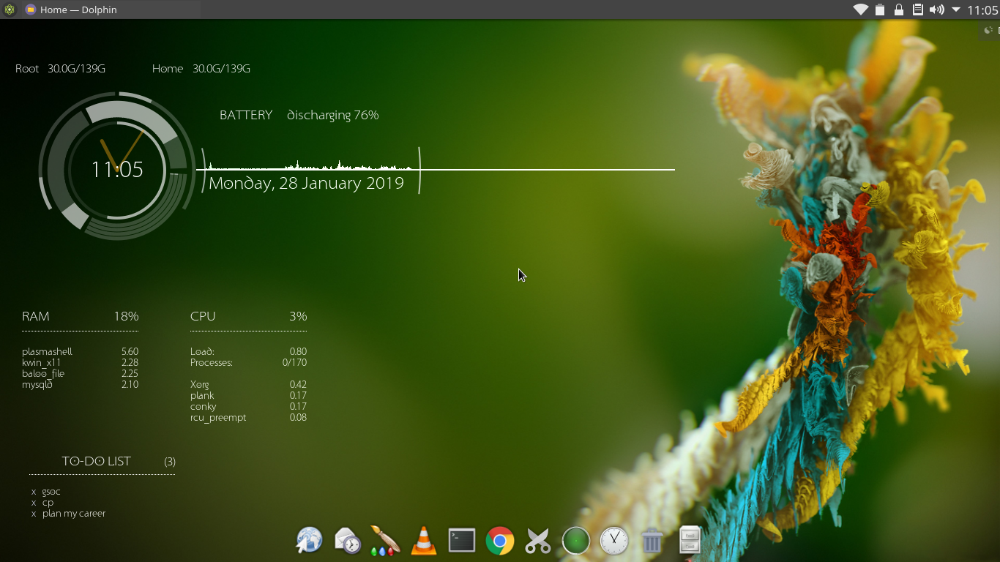

# Conky Rings Working Theme
- Innermost circle represent seconds
- after that 4 bars represent CPU and then RAM and Battery cloackwise
- Thin outer incomplete ring repsents root and home folder size
- Eventline graph over Timestamp represnts CPU usage
- notes (lists the contents of file "~/notes.txt")

Use the startconky.sh script to start them in proper order.
Put all the files in ~/.Conky/ and run the script to start them. You can autostart the script at startup to make it
load at every boot.

#TODO will work on it

--------------------------------------------------------------------------------------------------------------
Copied from https://github.com/psycho-valker/Conky-Rings-Improved 

